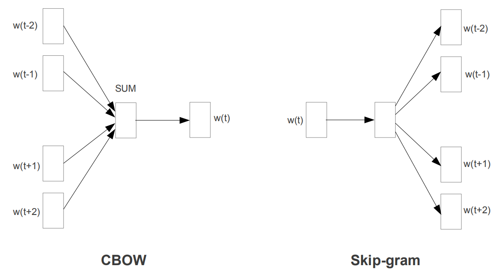
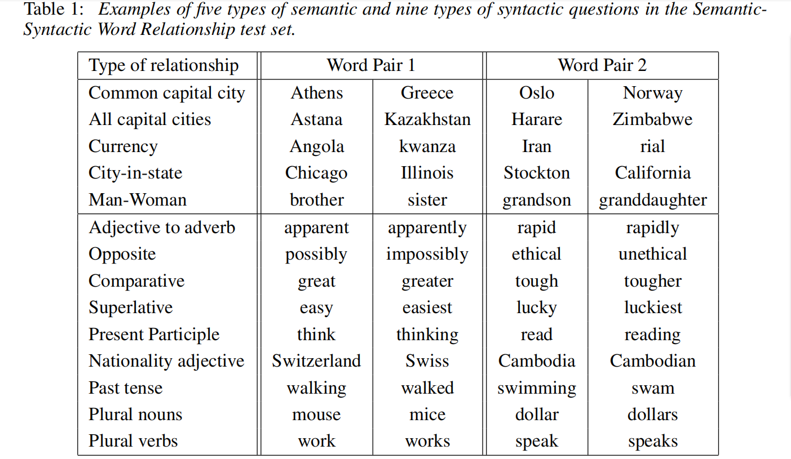
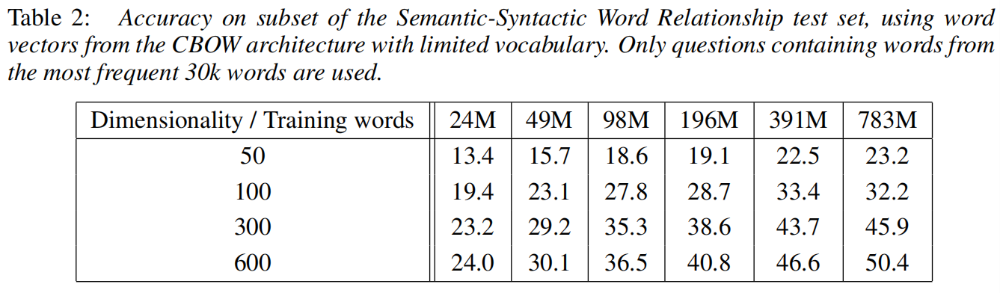
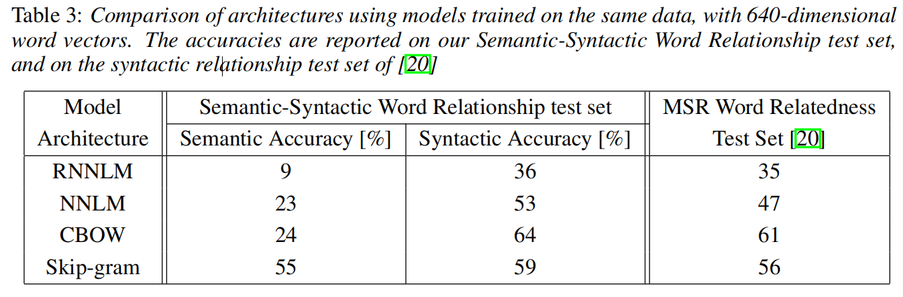

# [Word2Vec] Efficient Estimation of Word Representations in Vector Space (Google 2013)
---
论文来自https://github.com/wzhe06/Reco-papers/blob/master/Embedding/
# 1. Introuduction
- =.=！略

# 2. Model Architecture 
- 利用distributed representations of words learned by neural networks表示
- 随机梯度下降 stochastic gradient descent和反向传播backpropagation
- 模型训练时间复杂度：$O = E × T × Q$
    1. $E$ is number of the training epochs
    2. $T$ is the number of the words in the training set
    3. $Q$ is defined further for each model architecture

# 3. New Log-Linear Models(Two)
**Purpose**:  learning distributed representations of words that try to minimize computational complexity
### Continuous Bag-of-Words Model (CBOW)
- Function: predicting the current word based on the context
- Complexity: $ Q = N × D + D × \log_2^V $
### Continuous Skip-gram Model
- Function: it tries to maximize classification of a word based on another word in the same sentence.
- Complexity: $ Q = C × (D + D × log_2^V) $
- 逐渐增加窗口的宽度，结果向量的质量越高，但是训练时间复杂度随之增加。因为越远的单词关联度越低，那么就可以通过减少对其采样来训练样本。

# Results

